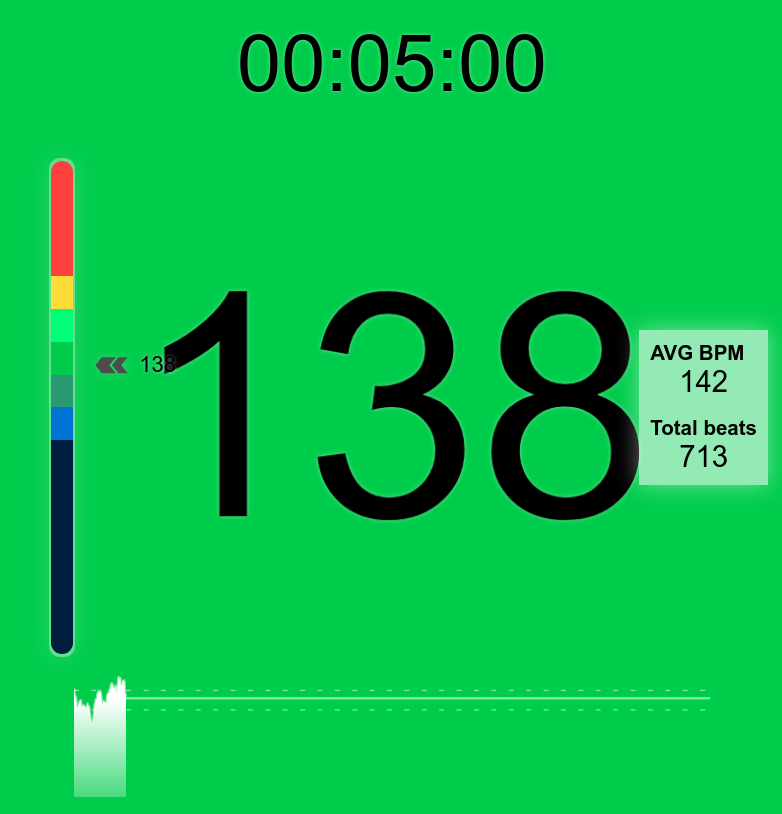

# miband5-coach

This is a web application that connects to a MiBand5
to show the heart beats during exercise.
I use it to monitor myself while using a stationary bicy.
You can set a execise time and a target bps and it
will show colors.

This uses vue and typescript.
It uses the bluetooth api that you will need to enable in the browser.
Moreover, you need the authkey for the band,
that can be obtaining with some 3º party app.




## Project setup
```
npm install
```

### Compiles and hot-reloads for development
```
npm run serve
```

### Compiles and minifies for production
```
npm run build
```

### Lints and fixes files
```
npm run lint
```

### Customize configuration
See [Configuration Reference](https://cli.vuejs.org/config/).


### Other repos and utils

* https://webbluetoothcg.github.io/web-bluetooth/
* https://github.com/Jaapp-/miband-5-heart-rate-monitor
* http://www.freemyband.com/
* https://geekdoing.com/threads/modified-mi-fit-5-0-2-all-in-one.2882/


Information.txt

git config user.name Javi
git config user.email javfres@users.noreply.github.com

